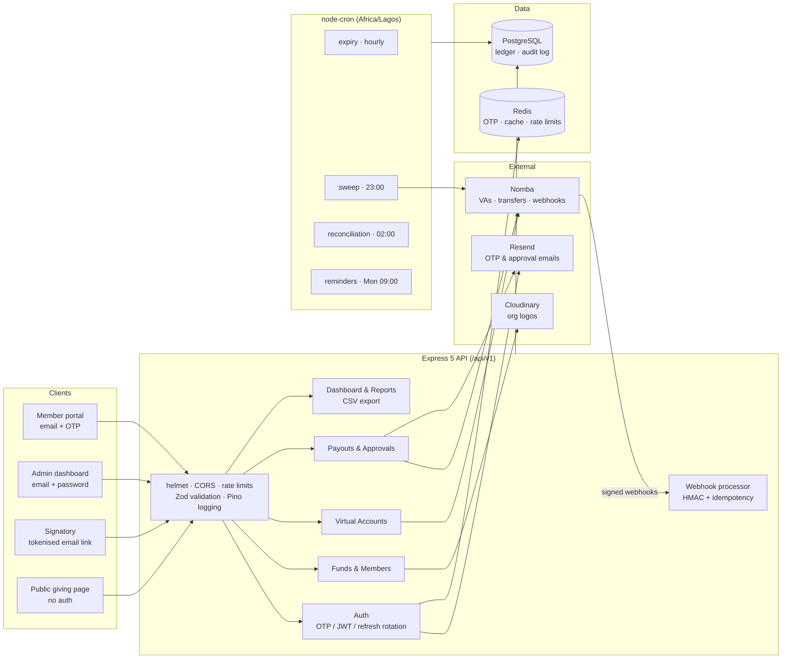
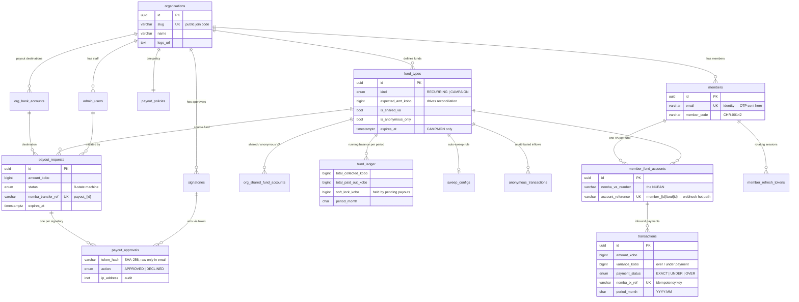
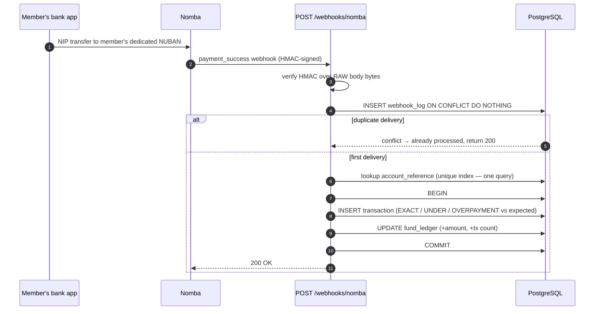
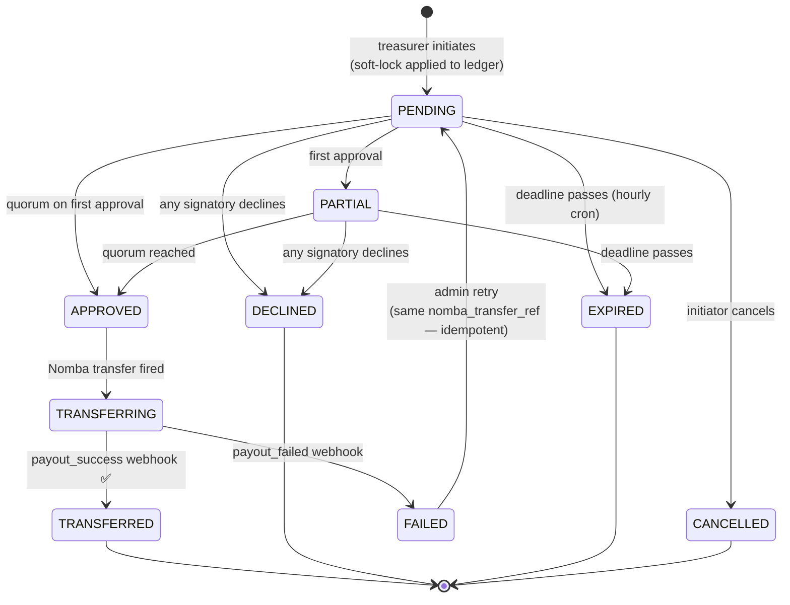

# Owoore

**Multi-tenant digital giving infrastructure for churches — built on dedicated virtual bank accounts.**

Owoore lets any church onboard in minutes, hand every member a *permanent, personal* NUBAN bank account per fund (Tithe, Offering, Building Fund…), and reconcile every naira automatically. Members give by simple bank transfer from any banking app — no cards, no USSD codes, no payment pages. The treasury side is governed by an M-of-N signatory approval workflow, so no single person can move church money alone.

Built with **TypeScript + Express 5 + PostgreSQL + Redis**, powered by **[Nomba](https://nomba.com)** virtual accounts and payouts.

---

## Table of Contents

- [Why this exists](#why-this-exists)
- [How it works](#how-it-works)
- [System architecture](#system-architecture)
- [Database schema](#database-schema)
- [The money path](#the-money-path)
- [Payout governance](#payout-governance)
- [API surface](#api-surface)
- [Background jobs](#background-jobs)
- [Security model](#security-model)
- [Getting started](#getting-started)
- [Project structure](#project-structure)
- [Testing](#testing)
- [Tech stack](#tech-stack)

---

## Why this exists

Church giving in Nigeria today is mostly cash in envelopes, or a single shared bank account with a WhatsApp screenshot as the "receipt". That means:

- **No attribution** — the treasurer can't tell who gave what without manually matching narrations.
- **No reconciliation** — pledged ₦50,000, received ₦45,000? Nobody notices.
- **No governance** — one person with the bank token can move everything.
- **No records** — members never get a statement of their giving.

DropTithe fixes all four with one primitive: **a dedicated virtual account per member per fund**. When money lands on that account, we already know *who* paid, *which* fund it was for, and *whether it matches* the expected amount — before a human ever looks at it.

## How it works

1. **A church registers** (`POST /orgs`) — gets a URL slug (`droptithe.app/join/grace-bible-church`), an admin dashboard account, and a default fund set.
2. **Members self-onboard** via the join link — identity is their **email**, auth is a **one-time OTP** (no passwords).
3. **A member taps "Pay Tithe"** — the backend lazily provisions a Nomba virtual account (NUBAN) reserved for *that member × that fund*, forever.
4. **The member transfers from any bank app.** Nomba fires a webhook; we verify the HMAC over the raw bytes, dedupe it, resolve the account reference in one indexed lookup, write the transaction, and update the fund ledger — atomically.
5. **The treasurer requests a payout.** Above the policy threshold, approval emails go to the configured signatories (Pastor, Elder, Trustee…). Only when the quorum approves does the transfer fire to the church's verified bank account.
6. **Nightly jobs** reconcile ledger totals against raw transactions, auto-sweep balances on schedule, expire stale approvals, and remind members on Mondays.

Anonymous giving is supported too: each org gets a shared "Anonymous Giving" VA exposed on a public `/give/:orgSlug` page — Sunday-service projector friendly, no login required.

---

## System architecture



**Design decisions worth knowing:**

- **Raw-body-first webhooks.** `express.raw()` is mounted on the webhook route *before* the global `express.json()` — the Nomba HMAC is computed over raw bytes, and parsing first would break signature verification permanently ([app.ts](src/app.ts)).
- **All money is `BIGINT` kobo.** No floats anywhere in the money path. Formatting to naira happens only at the presentation edge ([kobo.ts](src/utils/kobo.ts)).
- **Repository → Service → Controller** layering per module. Controllers never touch SQL; services never touch `req`/`res`.
- **One shared Nomba sub-account** for the platform; per-church balances live in the `fund_ledger` table, not at the Nomba level (migration 020).
- **Graceful shutdown** — SIGTERM stops cron jobs, closes the HTTP server, and drains the pg pool (Railway-deploy friendly).

---

## Database schema

27 forward-only SQL migrations, run transactionally by a tiny hand-rolled runner ([migrate.ts](src/db/migrate.ts)) that records completion in a `_migrations` table.



Supporting tables not shown: `otp_tokens` (email OTP with attempt lockout), `webhook_log` (every Nomba event, the idempotency store), `audit_log` (append-only — `UPDATE`/`DELETE` blocked by database rules), `payout_policies` (M-of-N quorum, threshold, token expiry).

**The one table to understand:** [`member_fund_accounts`](src/db/migrations/007_create_member_fund_accounts.sql). Its unique `account_reference` (`member_{uuid}_fund_{uuid}`) is passed to Nomba at VA creation and comes back on every webhook — a single indexed lookup resolves *member + fund + org* for any inbound payment.

Available balance is always derived, never stored:

```
available = total_collected − total_paid_out − soft_lock
```

---

## The money path

What happens when a member sends ₦5,000 from their banking app:



The `UNIQUE` constraint on `webhook_log.nomba_request_id` is the authoritative dedup guard — two concurrent deliveries race to insert, exactly one wins, and the loser returns before any business logic runs. Failed events stay flagged `processed = FALSE` with the error message for replay.

If the fund has an `expected_amt_kobo` (e.g. a pledge campaign), the variance is computed at write time and the payment is classified `EXACT`, `UNDERPAYMENT`, or `OVERPAYMENT` — arrears reports come for free.

---

## Payout governance

No single person can move church money. Every payout request walks a strict state machine ([payout-state.machine.ts](src/modules/payouts/payout-state.machine.ts)) — every status change must pass `assertTransition()` or throw:



How the approval flow actually works:

- Each org has one **payout policy**: `min_approvers` (default 2), `threshold_kobo` (default ₦100,000), token expiry (48 h), auto-decline window (72 h). Amounts *below* the threshold can be transferred directly; above it, quorum is mandatory.
- **Signatories never log in.** Each one gets an email with a single-use tokenised link. Only the **SHA-256 hash** of the token is stored; the raw token exists solely in the email. First use stamps `token_used_at` — replay is dead on arrival.
- Creating a request **soft-locks** the amount in `fund_ledger`, so two pending payouts can't both spend the same balance. The lock releases on any terminal state.
- One decline kills the request. No quorum inside 72 hours and the hourly expiry job kills it.
- Every action lands in the **append-only `audit_log`** — actor, entity, before/after JSON snapshots, IP address — with `UPDATE`/`DELETE` disabled at the database level.
- Retries of a `FAILED` transfer reuse the same `nomba_transfer_ref` (`payout_{uuid}`), so a retry can never double-spend on Nomba's side.

Destination accounts (`org_bank_accounts`) must pass a Nomba bank-account name lookup before they're marked verified — a payout can only target a verified account. Funds can also map to *specific* accounts (Building Fund → the building project account) with a default catch-all.

---

## API surface

All routes are prefixed `/api/v1`. Standard response envelope: `{ success, data | error }`.

<details>
<summary><strong>Auth</strong> — OTP for members, password + email-verification for admins</summary>

| Method | Route | Auth | Description |
|---|---|---|---|
| POST | `/auth/send-otp` | — | Email a 6-digit OTP (Redis-backed, attempt lockout) |
| POST | `/auth/verify-otp` | — | Verify OTP → member JWT + rotating refresh token |
| POST | `/auth/admin/login` | — | Admin email + password login |
| POST | `/auth/admin/verify-email` | — | OTP email verification for self-registered admins |
| POST | `/auth/refresh` | refresh token | Rotate refresh token, issue new access token (reuse of a revoked token nukes the whole session family) |

</details>

<details>
<summary><strong>Organisations & staff</strong></summary>

| Method | Route | Auth | Description |
|---|---|---|---|
| POST | `/orgs` | — | Register a church (name, slug, logo upload, first admin) |
| GET | `/orgs/:id` | admin | Org profile |
| PATCH | `/orgs/:id` | admin | Update profile / logo (multer → Cloudinary) |
| POST | `/admin-users/invite` | ADMIN | Invite a treasurer via tokenised email link |
| POST | `/admin-users/accept-invite` | token | Set password, activate account |

</details>

<details>
<summary><strong>Funds & members</strong></summary>

| Method | Route | Auth | Description |
|---|---|---|---|
| GET/POST | `/orgs/:orgId/funds` | admin | List / create funds (RECURRING or CAMPAIGN) |
| GET/PATCH/DELETE | `/funds/:id` | admin | Manage a single fund |
| GET | `/me` | member | Member profile (org-scoped, cached) |
| GET | `/me/funds` | member | Funds available to give to |
| GET | `/me/giving-history` | member | Paginated personal transactions |
| GET | `/members` | admin | Member roster with giving status |

</details>

<details>
<summary><strong>Virtual accounts & giving</strong></summary>

| Method | Route | Auth | Description |
|---|---|---|---|
| POST | `/me/funds/:fundId/account` | member | Get-or-create the member's dedicated NUBAN for a fund (lazy provisioning) |
| GET | `/me/accounts` | member | All of the member's VAs |
| GET | `/give/:orgSlug` | — | **Public** giving page — shared/anonymous VA details |
| POST | `/webhooks/nomba` | HMAC | Nomba event ingress (raw body, signature-verified) |

</details>

<details>
<summary><strong>Treasury — payouts, approvals, banks</strong></summary>

| Method | Route | Auth | Description |
|---|---|---|---|
| POST | `/payouts` | ADMIN/TREASURER | Initiate a payout request (soft-locks funds) |
| GET | `/payouts` · `/payouts/:id` | admin | List / inspect requests |
| DELETE | `/payouts/:id` | ADMIN/TREASURER | Cancel before any approval |
| GET | `/approve/:token` | token | Approval page details (rate-limited) |
| POST | `/approve/:token` | token | Approve — fires transfer when quorum reached |
| POST | `/approve/:token/decline` | token | Decline — kills the request |
| GET | `/banks` | admin | Nigerian bank list (cached from Nomba) |
| POST | `/banks/lookup` | admin | Resolve account number → account name |
| CRUD | `/signatories` · `/signatories/policy` | ADMIN | Manage approvers and the quorum policy |

</details>

<details>
<summary><strong>Dashboard & reports</strong></summary>

| Method | Route | Auth | Description |
|---|---|---|---|
| GET | `/dashboard/summary` | admin | Org-wide totals, balances |
| GET | `/dashboard/fund-breakdown` | admin | Per-fund collected / paid out / available |
| GET | `/dashboard/member-status` | admin | Who has / hasn't paid this period |
| GET | `/dashboard/payout-history` | admin | Treasury timeline |
| GET | `/orgs/:orgId/reports/giving` | admin | Giving report (JSON or CSV) |
| GET | `/members/:id/statement` | admin | Individual member statement |
| GET | `/reports/arrears` | admin | Underpayments vs expected amounts |

</details>

---

## Background jobs

Registered by [scheduler.ts](src/jobs/scheduler.ts) on boot, all in `Africa/Lagos`, all stopped cleanly on SIGTERM:

| Job | Schedule | What it does |
|---|---|---|
| [expiry.job](src/jobs/expiry.job.ts) | hourly | Auto-declines `PENDING`/`PARTIAL` payouts past their 72 h deadline, releases soft locks (partial-index scan) |
| [sweep.job](src/jobs/sweep.job.ts) | 23:00 nightly | Fires configured auto-sweeps (weekly/monthly, min-balance floor) from fund balances to verified church bank accounts |
| [reconciliation.job](src/jobs/reconciliation.job.ts) | 02:00 nightly | Recomputes ledger totals from raw transactions and flags drift — the ledger never silently diverges |
| [reminder.job](src/jobs/reminder.job.ts) | Mon 09:00 | Emails giving reminders to members |

---

## Security model

| Layer | Mechanism |
|---|---|
| Webhook ingress | HMAC-SHA256 over **raw body bytes**, verified before parsing; unique `requestId` constraint for exactly-once processing |
| Member auth | Email OTP (max 5 attempts, then lockout) → short-lived JWT (1 h) + **rotating refresh tokens** — reuse of a rotated token is treated as theft and revokes the whole family |
| Admin auth | bcrypt passwords, mandatory email verification for self-registration, role gates (`ADMIN` vs `TREASURER`) on every mutating route |
| Signatory auth | Single-use tokens, SHA-256 hash at rest, expiry + `token_used_at` replay guard, per-route rate limiting, IP logged |
| Treasury | M-of-N quorum, initiator can't self-approve, soft-locked balances, state machine rejects every illegal transition at 409 |
| Audit | Append-only `audit_log` with before/after snapshots — immutable via database `RULE`s, not just convention |
| Transport/API | helmet, strict CORS, express-rate-limit, Zod validation on body/params/query, no stack traces in production errors |
| Money integrity | kobo-only `BIGINT` arithmetic, `CHECK` constraints on every balance column, idempotent transfer refs |

The full write-up — architecture diagrams, webhook durability contract, failure-mode table — lives in [docs/ARCHITECTURE-SECURITY.md](docs/ARCHITECTURE-SECURITY.md).

---

## Getting started

**Prerequisites:** Node 20+, PostgreSQL 14+, Redis 6+, and API keys for [Nomba](https://developer.nomba.com) (sandbox works), [Resend](https://resend.com), and [Cloudinary](https://cloudinary.com).

```bash
# 1. Clone & install
git clone https://github.com/lordisrael1/Owoore.git
cd Owoore
npm install

# 2. Configure — every variable is validated by Zod at boot with a
#    clear error message, so missing config fails fast, not at runtime
cp .env.example .env
# fill in DATABASE_URL, REDIS_URL, NOMBA_*, JWT_SECRET (32+ chars),
# RESEND_API_KEY, CLOUDINARY_*

# 3. Create the schema (transactional, resumable, tracked in _migrations)
npm run db:migrate

# 4. Run
npm run dev        # tsx watch — hot reload
npm start          # production mode
```

The server boots in a strict sequence — env validation → Postgres ping → Nomba token (auto-refreshed every 55 min) → Resend check → bank-list cache warm → HTTP listen → cron registration — and refuses to start if any dependency is down.

**Webhooks in development:** expose your local port with `ngrok http 4000` and point the Nomba dashboard webhook URL at `https://<tunnel>/api/v1/webhooks/nomba`.

| Script | Purpose |
|---|---|
| `npm run dev` | Watch mode via tsx |
| `npm start` | Run the server |
| `npm test` | Vitest suite (Supertest HTTP tests) |
| `npm run test:watch` | Vitest watch mode |
| `npm run db:migrate` | Apply pending SQL migrations |

---

## Project structure

```
src/
├── app.ts                  # Express factory — middleware order is load-bearing
├── server.ts               # Bootstrap, dependency checks, graceful shutdown
├── config/                 # env (Zod-validated), db pool, nomba, resend, cloudinary, jwt
├── db/
│   ├── migrate.ts          # Transactional migration runner
│   └── migrations/         # 27 numbered, commented SQL files — the schema reads like docs
├── middleware/             # authenticate, authorise, validateRequest (Zod),
│                           # webhookVerify (raw-body HMAC), ratelimiter, upload, logging
├── jobs/                   # scheduler + expiry / sweep / reconciliation / reminder crons
├── modules/                # Feature modules: routes → controller → service → repository
│   ├── auth/               # OTP, admin login, refresh-token rotation
│   ├── organisations/      # Church onboarding, slugs, logos
│   ├── admin-users/        # Treasurer invites (tokenised links)
│   ├── members/            # Member portal, giving history, ledger
│   ├── fund/               # RECURRING & CAMPAIGN fund management
│   ├── virtual-accounts/   # Lazy Nomba VA provisioning (member, shared, anonymous)
│   ├── anonymous/          # Public /give/:orgSlug page
│   ├── webhooks/           # Processor, idempotency, inflow handler, dispatcher
│   ├── transactions/       # Ledger service, reconciliation
│   ├── payouts/            # State machine, transfers, sweeps, bank lookup
│   │   └── approvals/      # Quorum, single-use tokens, approval endpoints
│   ├── signatories/        # Approver management + payout policy
│   ├── dashboard/          # Admin aggregates
│   └── reports/            # Giving reports, statements, arrears, CSV export
├── notifications/email/    # Resend templates & sending
└── utils/                  # kobo math, crypto, slugs, phone/email normalisation, AppError
tests/                      # Vitest + Supertest
```

Every module follows the same shape — `*.routes.ts` (wiring + middleware) → `*.controller.ts` (HTTP concerns) → `*.service.ts` (business rules) → `*.repository.ts` (parameterised SQL). No ORM: the queries are explicit, reviewable, and indexed deliberately (see [018_add_indexes.sql](src/db/migrations/018_add_indexes.sql), which documents every hot path).

---

## Testing

```bash
npm test
```

Vitest + Supertest exercise the HTTP layer end-to-end (see [tests/](tests/)). The webhook idempotency guard, state machine, and ledger math are designed to be safe under concurrency at the *database* level (unique constraints, transactions, check constraints) — not just in application code — so the invariants hold even for code paths a test forgot.

---

## Tech stack

| Concern | Choice | Why |
|---|---|---|
| Runtime | Node.js + TypeScript (via `tsx`) | Types across the whole money path, zero build step in dev |
| HTTP | Express 5 | Boring, predictable, async-error-aware |
| Database | PostgreSQL via `pg` (raw SQL) | Constraints, transactions, and partial indexes do the heavy lifting |
| Cache / OTP | Redis | OTP TTLs, hot caches, cross-instance rate limits |
| Payments | Nomba | Virtual account issuance, NIP payouts, signed webhooks |
| Email | Resend | OTPs, approval links, invites, reminders |
| Media | Cloudinary | Org logo storage |
| Validation | Zod | Env vars *and* request bodies — one schema language everywhere |
| Logging | Pino | Structured JSON logs, request-scoped |
| Scheduling | node-cron | In-process jobs with graceful shutdown |
| Tests | Vitest + Supertest | Fast, TS-native |

---

## License

[ISC](LICENSE)

---

*Owoore — accountability infrastructure for community giving. Every naira attributed, every payout approved, every action audited.*
